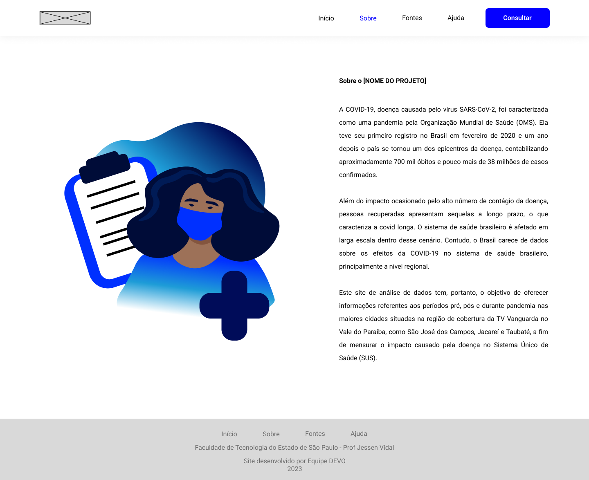
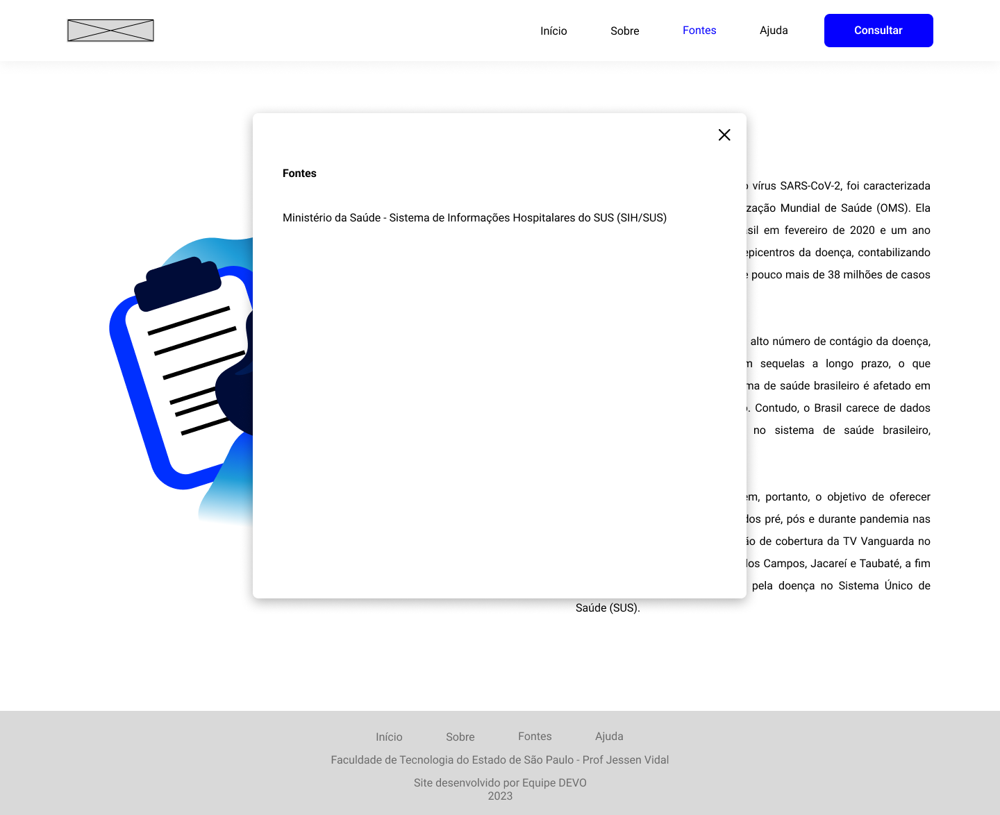
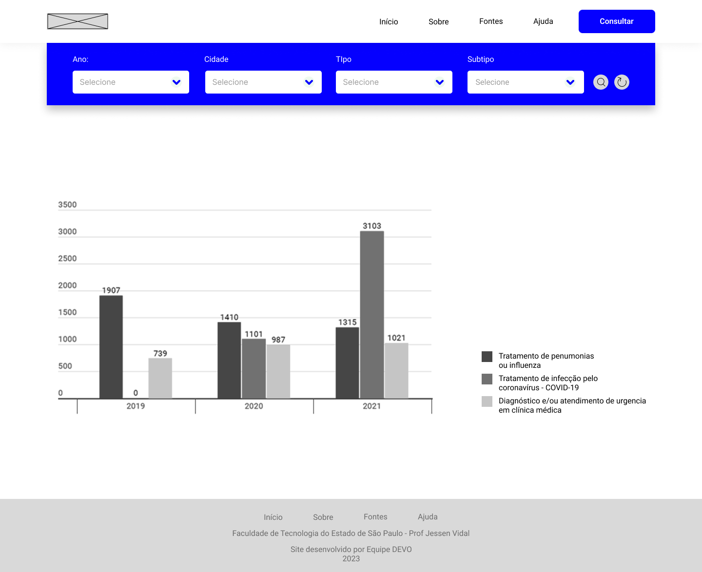

 

# 1ª Sprint

## [Ir para a tela de início](./../../../README.md)

## :mag_right: Índice

* [Descrição](#descrição)
* [MVP](#MVP)
* [Backlog](#backlog)
* [Wireframe](#wireframe)

# Descrição
Nesta primeira entrega foi priorizado o levantamento de requisitos (backlog), o protótipo (Wireframe) e o planejamento do projeto.

# :triangular_flag_on_post: Minimum Viable Product (MVP)

* [Protótipo](#wireframe)

# Backlog

[Clique aqui](./Backlog_sprint1.md) para acessar o backlog da primeira sprint.

→ [Voltar ao topo](#topo)

# Wireframe

Prótotipo do projeto.

→ [Voltar ao topo](#topo)

## [Ir para a tela de início](./../../../README.md)